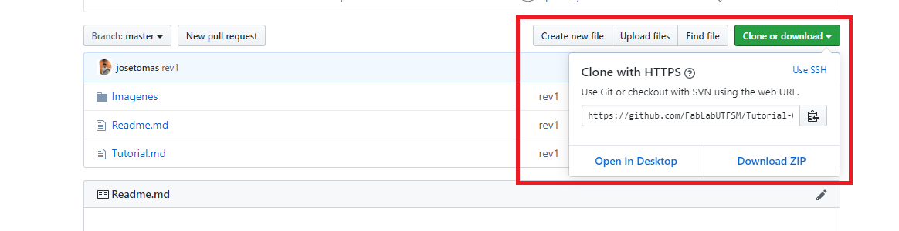
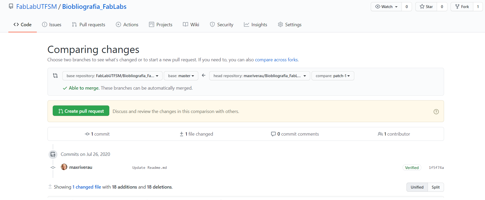
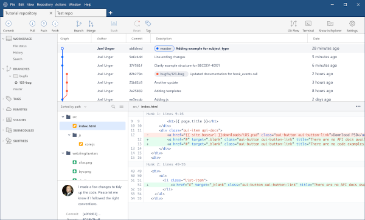
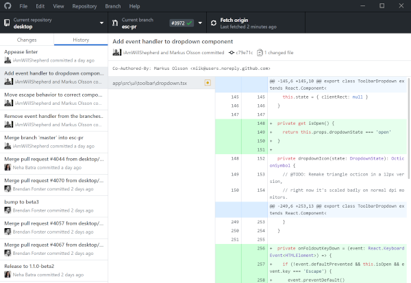
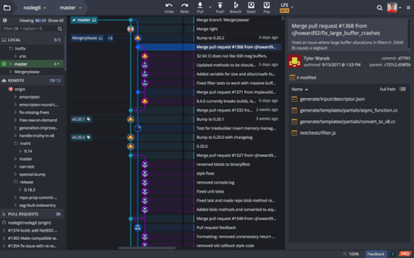
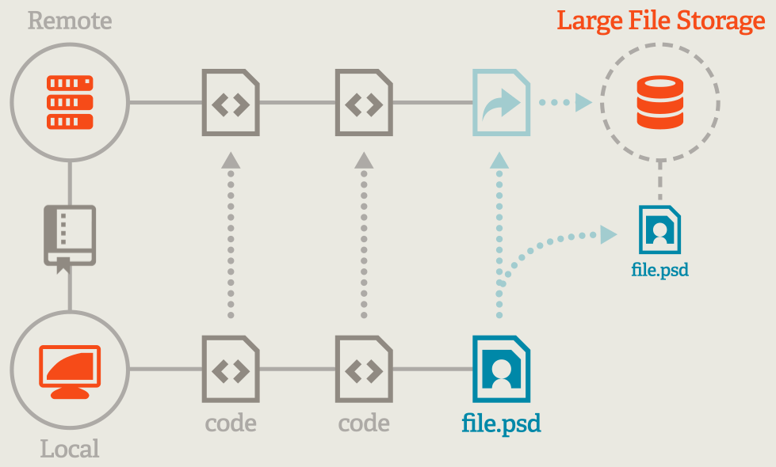
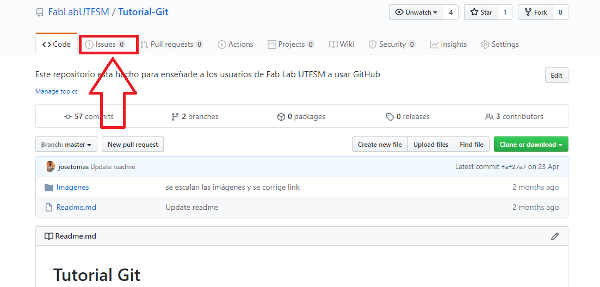
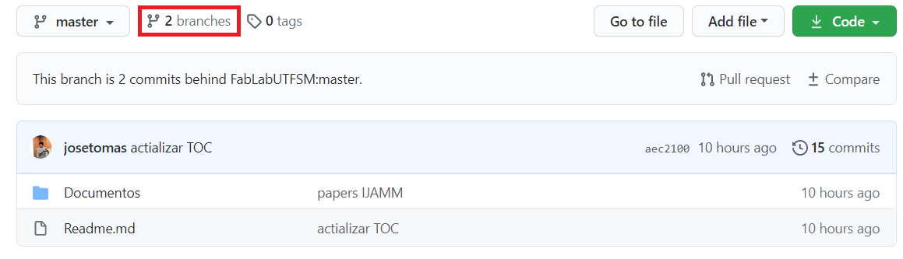
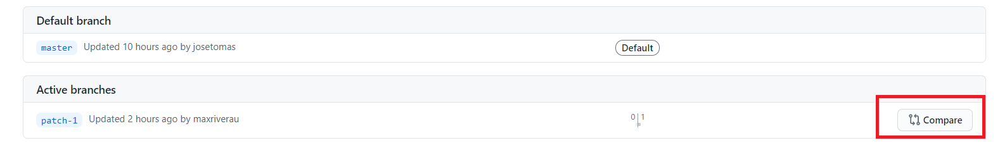

# Tutorial Git


- [Tutorial Git](#tutorial-git)
  * [Instalar Git](#instalar-git)
  * [Git](#git)
    + [Control de versiones](#control-de-versiones)
    + [Que es Git](#que-es-git)
    + [Github](#github)
    + [Definiciones](#definiciones)
    + [Fases de trabajo en Git](#fases-de-trabajo-en-git)
    + [Comandos clave](#comandos-clave)
    + [Herramientas gráficas](#herramientas-gráficas)
  * [Git- Large File Storage](#git--large-file-storage)
    + [Comandos claves](#comandos-claves)
  * [Markdown](#markdown)
    + [Lista de enlaces con tutoriales o herramientas para Markdown](#lista-de-enlaces-con-tutoriales-o-herramientas-para-markdown)
  * [Issues](#Issues) 
  * [Troubleshooting](#Troubleshooting) 
  * [Autores](#Autores) 

## Instalar Git 

Descargar el instalador de Git para su sistema operativo [aquí](https://git-scm.com/downloads)

Tutorial de como instalar Git [aqui](https://git-scm.com/book/en/v2/Getting-Started-Installing-Git). 

## Git

### Control de versiones

Se llama control de versiones a la gestión de los diversos cambios que se realizan sobre los elementos de algún producto o una configuración de este. Una versión, revisión o edición de un producto, es el estado en el que se encuentra el mismo en un momento dado de su desarrollo o modificación. [[1]](https://es.wikipedia.org/wiki/Control_de_versiones)

### Que es Git

Específicamente, Git es un sistema de control de versión distribuida, lo que quiere decir que la base del código entero y su historial se encuentran disponibles en la computadora de todo desarrollador, lo cual permite un fácil acceso a las bifurcaciones y fusiones.

### Github 

GitHub es una compañía sin fines de lucro que ofrece un servicio de hosting de repositorios almacenados en la nube. Esencialmente, hace que sea más fácil para individuos y equipos usar Git como la versión de control y colaboración.

La interfaz de GitHub es bastante fácil de usar para el desarrollador novato que quiera aprovechar las ventajas del Git. Sin GitHub, usar un Git generalmente requiere de un poco más de conocimientos de tecnología y uso de una línea de comando.

GitHub es tan fácil de usar, que incluso algunas personas usan GitHub para administrar otro tipo de proyectos – como escribir libros.

Además de esto, cualquier persona puede inscribirse y ser hospedar un repositorio de código público completamente gratuito, el cual hace que GitHub sea especialmente popular con proyectos de fuente abierta.[[2]](https://kinsta.com/es/base-de-conocimiento/que-es-github/)


### Definiciones

- Repositorio: Un repositorio es un espacio centralizado donde se almacena, organiza, mantiene y difunde información digital, habitualmente archivos informáticos. [[2]](https://es.wikipedia.org/wiki/Repositorio). 
- Branch: Cuando hablamos de ramificaciones, significa que tú has tomado la rama principal de desarrollo (master) y a partir de ahí has continuado trabajando sin seguir la rama principal de desarrollo. [[4]](https://git-scm.com/book/es/v2/Ramificaciones-en-Git-%C2%BFQu%C3%A9-es-una-rama%3F)

 [[5]](https://www.nobledesktop.com/learn/git/git-branches)

- Commit: Un "commit" es la acción de guardar una actualización de tus cambios, puede hacerse en el repositorio o de forma local. Siempre va acompañado de un mensaje. [[6]](https://codigofacilito.com/articulos/commits-administrar-tu-repositorio) 

- Git Bash: Git Bash es una aplicación para Windows donde se emula la experiencia de una línea de comandos de Git.

- Origin: Corresponde a la dirección remota en donde está almacenado el repositorio. 

### Fases de trabajo en Git

 [[7]](https://www.codepoc.io/blog/git/5287/git-quick-reference-guide)


### Comandos clave

- git config –-global user.name “Example Name”: Configura el nombre de usuario de quien hace los commits. 

- git config –-global user.email “email@example.com”: Configura la dirección email de quien hace los commits. 

- git init: Inicia git en la carpeta en la que vamos a trabajar.

- git clone [dirección https del repositorio]: Toma un repositorio online, y lo clona en una dirección local. 



- git status: Nos muestra la etapa en la que se encuentran las modificaciones que hemos realizado. 

```
On branch master
Your branch is up to date with 'origin/master'.

Changes to be committed:
  (use "git reset HEAD <file>..." to unstage)

        new file:   Images/git-lfs.PNG
        modified:   Readme.md

Changes not staged for commit:
  (use "git add <file>..." to update what will be committed)
  (use "git checkout -- <file>..." to discard changes in working directory)

        modified:   Readme.md

```

- git add . : Pasa todos los archivos en los que estamos trabajado de unstage a stage, el punto es el que implica todos los archivos modificados cambien de estado.  

- git add [Archivo]: Pasa solo un archivo de unstage a stage, el archivo debe ser especificado con nombre, extensión y ubicación. 

- git commit -m "aquí explicamos que contiene este commit": Pasa nuestras modificaciones del staging área al local repo. 

- git push origin [branch]: Empuja todos los cambios realizados por el usuario en su repositorio local, al repositorio remoto. 
 
- git branch: Muestra todas las branch que existen en el repositorio. 

- git branch [nombre del nuevo branch]: Crea una nueva branch en el repositorio. 

- git checkout [nombre del branch]: Cambiamos de branch en la que estaremos trabajando. 

- git merge [nombre del branch]: Une el branch con el master. 

- git branch -d [nombra del branch]: Elimina un branch.

- Fork: Git fork quiere decir que creaste una copía del repositorio principal, a tu propio perfil de github: 

 

En la imagen podemos ver que el usuario mariverau realizo un fork desde el repositorio Bibliografia_FabLabs ubicado dentro de la organización Fab Lab UTFSM a (FabLabUTFSM/Bibliografia_FabLabs) a su repositorio local maxriverau/Bibliografia_FabLabs. (ver cuadrado negro)

Al hacer un commit, este se mantendrá en su repositorio local, para enviarlo al repositorio principal, debe hacer clicl en el boton verde que dice "Create  pull request", esto le enviará al administrador del repositorio un issue para aceptar los cambios. 


### Herramientas gráficas

Si la línea de comandos no te acomoda, existen varias herramientas gráficas que nos permiten trabajar con git sin necesidad de utilizar comandos, y se encargan de gran parte de la administración del repositorio por nosotros. Cada una de estas herramientas tiene su propia curva de aprendizaje. Se listan algunas alternativas, cada una con un video-tutorial asociado para su manejo.

Estas aplicaciones no requieren que ustedes tengan git instalados en sus computadores, ya que pueden instalar su propia versión, pero también pueden funcionar con la que tienen instaladas. Todas las opciones listadas están disponibles para Windows y Mac.

#### SourceTree



La más completa y con la mayor cantidad de opciones para el manejo de repositorios git. Normalmente se asocia con BitBucket (un competidor de Github) pero puede administrar cualquier repositorio git sin importar dónde se hospede. [Video-tutorial de SourceTree](https://www.youtube.com/watch?v=QnkiKrruJiE)

#### GitHub Desktop



Una aplicación que simplifica el uso de repositorios git, no tiene tantas opciones de configuración lo que puede hacer más sencilla la interacción. Diseñado para usarse con repositorios en GitHub ya que posee herramientas para enviar *pull requests* y otras cosas que son propias del sitio pero también puede administrar cualquier repositorio. [Video-tutorial de GitHub Desktop](https://www.youtube.com/watch?v=IW28zJc7BN0)

#### GitKraken



Aplicación muy completa para el uso de git. Es una aplicación gratuita con algunas funciones no esenciales que se activan en la versión de pago. Tiene varias cosas interesantes que la hacen única como un gestor de tareas integrado, pero en general cubre todos los casos de uso propios de un administrador de repositorios y no está asociado a ningún servicio. [Video-tutorial de GitKraken](https://www.youtube.com/watch?v=z1CpcG-vs8U)


## Git- Large File Storage 


Github no soporta archivos mayores a 100 mb, esto es muy importante si se trabajará con archivos 3D (por lo general los .stl superan este tamaño). Para trabajar con archivos más grandes existe [git large file storage - git-lfs](https://git-lfs.github.com/), en la siguiente imagen se muestra el workflow con el que trabaja git-lfs y git: 

 
 
[[8]](https://git-lfs.github.com/)

### Comandos claves

- git lfs install: Instala git-lfs. 

- ```git lfs track "*.psd"```: Define que extensión tendrán los archivos que se almacenarán en git-lfs.

- git add .gitattributes: Crea un archivo .gitattributes donde se detalla que extensiones iran a git-lfs. 

## Markdown

Markdown nació como herramienta de conversión de texto plano a HTML.

Aunque en realidad Markdown también se considera un lenguaje que tiene la finalidad de permitir crear contenido de una manera sencilla de escribir, y que en todo momento mantenga un diseño legible, así que para simplificar puedes considerar Markdown como un método de escritura.

De cara al usuario final no hay ninguna diferencia, por ejemplo, este tutorial acerca de cómo funciona git está escrito en Markdown, y sin embargo ves que está perfectamente formateado [[9]](https://markdown.es/). 

Markdown es muy semejante a [latex](https://www.latex-project.org/). 

### Lista de enlaces con tutoriales o herramientas para Markdown

- [Markdown.es](https://markdown.es/)
- [Table of content](http://ecotrust-canada.github.io/markdown-toc/)
- [Visualizar MarkDown](http://tmpvar.com/markdown.html#Troubleshooting): Este enlace permite visualizar el codigo antes de hacer el push a GitHub. 

## Issues

En caso de tener dudas o comentarios sobre las tematicas que se tocan en el repositorio, se puede subir un Issue, con el fin de que sean contestados por quienes trabajan en el repositorio. 

 

## Troubleshooting
- En caso de estar trabajando en distintas plataformas, Git puede presentar problemas con el comando asignado al cambio de lineas: 

  * git config --global core.autocrlf false: Distintas plataformas o sistemas operaticos utilizan CRLF o LF como cambio de linea, este comando nos servirá en caso de que aparesca el siguiente error: 
```
Warning: LF will be replaced by CRLF

``` 
  **Importante**: Este comando funciona unicamente para usuarios de Windows haciendo proyectos UNICAMENTE en windows. [[10]](https://git-scm.com/book/it/v2/Customizing-Git-Git-Configuration)


- En caso de querer borrar un commit, o volver a atras: 

  * git log: Muestra el historial de commits que existe en el repositorio:

    ```
    commit a42e20a975801752e342eb07d7f4fe9544d981e1 (HEAD -> master, origin/master, la)
    Author: josetomas <josetodf@gmail.com>
    Date:   Sat Apr 18 10:32:28 2020 -0400

      avances

    commit 74f1c4923da436b66c4d0f02d0775c085cf8c06b
    Author: josetomas <josetodf@gmail.com>
    Date:   Sat Apr 18 10:31:07 2020 -0400

      avances

    commit c598804aed439ff10233d50b0f13e71d5d6080aa
    Author: josetomas <josetodf@gmail.com>
    Date:   Sat Apr 18 10:30:21 2020 -0400

      avances

    commit 02932175348a29f992e41c1a1f347a1d80947b15
    Author: josetomas <josetodf@gmail.com>
    Date:   Fri Apr 17 18:41:47 2020 -0400
    ```
  * git reset [número del commit - 02932175348a29f992e41c1a1f347a1d80947b15]: Retorno el repositorio al commit asociado a ese número, esto en caso de que hayamos cometido algun error. 


- En caso de que tengamos problemas empujando desde el repositorio local al remoto, porque el origin no ha sido definido: 
  * git remote add origin [dirección https del repositorio]: En caso de que el Bash nos arroje como error la falta de un "origin", este comando solucionará nuestros problemas. 

    ```
    fatal 'origin' does not appear to be a git repository - fatal Could not read from remote repository.
    ```

- Los cambios que hice desde la pagina GitHub aparecen en el repositorio, pero los demas usuarios no pueden verlos: 

  Lo mas probable es que hayas hecho un fork, por lo que los cambios estén en tu github pero no en el repositorio general. Para enviar los cambios al repositorio principal debes hacer un pull request, y el adminsitrador lo acepte. 

  Para hacer esto, vamos a nuestro perfil en donde debería existir un repositorio con la dirección [mi peril]/[nombre repositorio], hacemos click en este y hacemos click en branches: 

   
  
  Una vez ahi, hacemos click compare: 

  

 Una vez ahí nos dirá si podemos merge los branches. En caso de que se pueda, hacemos click en el boton "Create pull request" de color verde. 


## Colaborar en un proyecto
1) Si deseas colaborar en algún proyecto, el primer paso es dirigirte a su repositorio de GitHub. 
2) Luego debes clonarlo, de esta forma podrás trabajar con él en tu computadora. Si estás en GitHub Desktop, debes pegar la URL en File -> Clone repository.
3) Edita los archivos. Una vez realizados todos los cambios y haber guardado el/los archivo/s, realiza un commit. Si es desde Git, recuerda añadir el/los archivos primero; si es desde GitHub Desktop, los añadirá automáticamente.
4) Haz push de los cambios. Habrás actualizado los archivos.

## Autores

Este tutorial fue escrito por [José Tomás Domínguez](https://github.com/josetomas), [Pablo Albornoz](https://github.com/fixmycode) y [Josué Venegas](https://github.com/st4rb00y).
