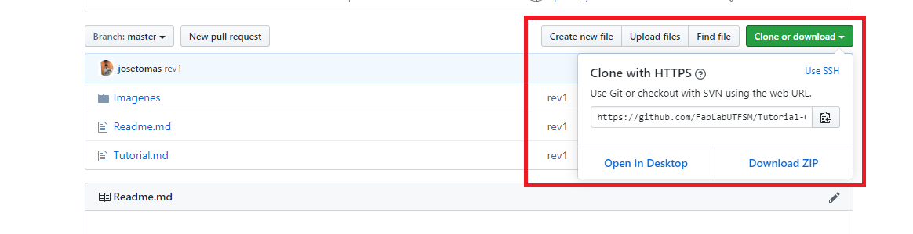

# Tutorial Git

- [Tutorial Git](#tutorial-git)
  * [Instalar Git](#instalar-git)
  * [Git](#git)
    + [Control de versiones](#control-de-versiones)
    + [Que es Git](#que-es-git)
      - [Github [[2]](https://kinsta.com/es/base-de-conocimiento/que-es-github/)](#github---2---https---kinstacom-es-base-de-conocimiento-que-es-github--)
    + [Definiciones](#definiciones)
    + [Fases de trabajo en Git](#fases-de-trabajo-en-git)
      - [Comandos clave](#comandos-clave)

<small><i><a href='http://ecotrust-canada.github.io/markdown-toc/'>Table of contents generated with markdown-toc</a></i></small>


## Instalar Git 

Descargar el instalador de Git para su sistema operativo [aqui](https://git-scm.com/downloads)

Tutorial de como instalar Git [aqui](https://git-scm.com/book/en/v2/Getting-Started-Installing-Git). 

## Git

### Control de versiones

Se llama control de versiones a la gestión de los diversos cambios que se realizan sobre los elementos de algún producto o una configuración del mismo. Una versión, revisión o edición de un producto, es el estado en el que se encuentra el mismo en un momento dado de su desarrollo o modificación. [[1]](https://es.wikipedia.org/wiki/Control_de_versiones)

### Que es Git

Específicamente, Git es un sistema de control de versión distribuida, lo que quiere decir que la base del código entero y su historial se encuentran disponibles en la computadora de todo desarrollador, lo cual permite un fácil acceso a las bifurcaciones y fusiones.

#### Github [[2]](https://kinsta.com/es/base-de-conocimiento/que-es-github/)

GitHub es una compañía sin fines de lucro que ofrece un servicio de hosting de repositorios almacenados en la nube. Esencialmente, hace que sea más fácil para individuos y equipos usar Git como la versión de control y colaboración.

La interfaz de GitHub es bastante fácil de usar para el desarrollador novato que quiera aprovechar las ventajas del Git. Sin GitHub, usar un Git generalmente requiere de un poco más de conocimientos de tecnología y uso de una línea de comando.

GitHub es tan fácil de usar, que incluso algunas personas usan GitHub para administrar otro tipo de proyectos – como escribir libros.

Además de esto, cualquier persona puede inscribirse y ser hospedar un repositorio de código público completamente gratuito, el cual hace que GitHub sea especialmente popular con proyectos de fuente abierta.


### Definiciones

- Respositorio: Un repositorio es un espacio centralizado donde se almacena, organiza, mantiene y difunde información digital, habitualmente archivos informáticos. [[2]](https://es.wikipedia.org/wiki/Repositorio). 
- Branch: Cuando hablamos de ramificaciones, significa que tú has tomado la rama principal de desarrollo (master) y a partir de ahí has continuado trabajando sin seguir la rama principal de desarrollo. [[4]](https://git-scm.com/book/es/v2/Ramificaciones-en-Git-%C2%BFQu%C3%A9-es-una-rama%3F)

 [[5]](https://www.nobledesktop.com/learn/git/git-branches)

- Commit: Un "commit" es la acción de guardar una actualización de tus cambios, puede hacerse en el repositorio o de forma local. Siempre va acompañado de un mensaje. [[6]](https://codigofacilito.com/articulos/commits-administrar-tu-repositorio) 

- Git Bash: Git Bash es una aplicación para Windows donde se emula la experiencia de una linea de comandos de Git.

- Origin: Corresponde a la dirección remota en donde está almacenado el repositorio. 

### Fases de trabajo en Git

 [[7]](https://www.codepoc.io/blog/git/5287/git-quick-reference-guide)


#### Comandos clave

- git config –global user.name “Example Name”: Configura el nombre de usuario de quien hace los commits. 

- git config –global user.email “email@example.com”: Configura la dirección email de quien hace los commits. 

- git init: Inicia git en la carpeta en la que vamos a trabajar.

- git clone [dirección https del repositorio]: Toma un repositorio online, y lo clona en una dirección local. 



- git remote add origin [dirección https del repositorio]: En caso de que el Bash nos arroje como error la falta de un "origin", este comando solucionará nuestros problemas. 

```
fatal 'origin' does not appear to be a git repository - fatal Could not read from remote repository.
```
- git status: Nos muestra la etapa en la que se encuentran las modificaciones que hemos realizado. 

- git add .: Pasa todos los archivos en los que estamos trabajado de unstage a stage. 

- git add [Archivo]: Pasa solo un archivo de unstage a stage, el archivo debe ser especificado con nombre, extensión y ubicación. 

- git commit -m "aqui explicamos que contiene este commit": Pasa nuestas modificaciones del staging area al local repo. 

- 